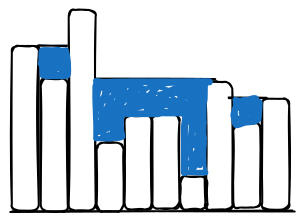

+++
author = ["Kush"]
title = "Thinking From Scratch"
date = "2024-10-02"
description = "You are given an array of positive integers representing the heights of different buildings (in sequence) with unit width. Now assuming uniform rainfall falls over the entire 2 dimensional city, and water gets collected between every building fully until it can overflow, what will the total volume of the collected water be? I feel like it is important to take a step back, and think from scratch when you can't rely on memory or knowledge."
type = "post"
math = true
+++

Here is a simple problem. You are given an array of positive integers representing the heights of different buildings (in sequence) with unit width. Now assuming uniform rainfall falls over the entire 2 dimensional city, and water gets collected between every building fully until it can overflow, what will the total volume of the collected water be?

How a course teacher approached it was using some strategy previously discussed in a class. They had two loops figure out the right and left maximums for each building. Meaning, every building has another building some distance to its left whith the maximum height in it's entire left, and same for the right side. When the heights maximum on the left and right side of every building were stored in two separate arrays, another loop can simply compare the two limits, and subtract the height of each building from the lower limit to find how much water is there exactly on top of that particular building. Add all the water above every building, and you get the total volume. However I had a very different simpler approach.

## Thinking from Scratch

We can start thinking of our new approach in the form of puddles.

- The total water stored is just the sum of all the water stored in the puddles (which may encompass one or more buildings).
- To get the volume in a puddle, simply start a loop from the beginning of the array. Consider certain variables to be the state of our current scan. We need to have mutable variables "current candidate", "puddle volume" and "total volume" declared at the beginning of our program.
- Assume the current candidate to be the first element of the array, and start iterating over the array. If the next element of the array is smaller than our current candidate, then the water stored above it is simply the difference between the height of the current candidate and the height of the element where we are at. Add that to the puddle volume.
- However, if the element we got to is either larger, or equal to the current candidate, then the puddle is completed. Add the water collected in the puddle to the total volume, reset the puddle volume to zero, and reassign the element as our new current candidate.
- Continue doing this, eventually there will be a point when our current candidate will be the tallest building in the array, and the puddle water gets added for every subsequent building even though it is now inaccurate. But we should not worry about this, since after the tallest building becomes our current candidate, it is never going to encounter any element equal to or larger than it's height, so all that surplus is never going to get counted in the total volume.
- When the loop is finished, we would have calculated the volume of the water to the entire left side of the tallest building.
- Now start iterating in reverse, and follow the same logic. This will add the water from the right side of the entire array to our total volume.
- At the end of two complete loops, we will have collected the entire water from all the puddles.

The one small exception here would be if there are more than one _tallest_ buildings (meaning there are more than one buildings with the same maximum height), In this case, the water between the first tallest building and the last tallest building would be counted twice. We can simply fix this by creating a third state variable that records the maximum height attained in our first loop. The second loop will end as soon as any maximum height element is found (element with the maximum height we recorded in the previous loop).

You can try to visualize the algorithm with the steps I gave above. Notice how we only need less than two full loops and a handful of variables stored in memory to compute this in contrast to the given solution which required two arrays of same length to be stored, along with 3 full loops.
